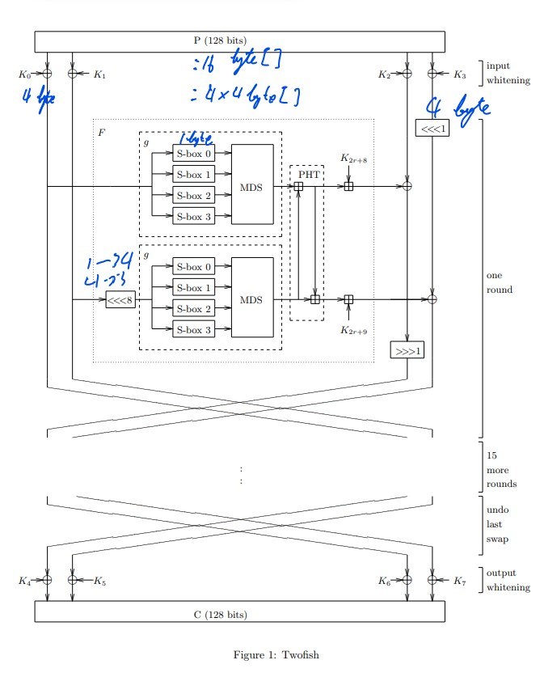

# Final Report

## Link to my source code (host on my Pitt OneDrive)

Click below:

https://pitt-my.sharepoint.com/:f:/g/personal/luc68_pitt_edu/EqEBkPxBZbNLuUDh7rhkgjgBbp1oXpi2QNn3mZo7yvrG5A?e=mZVauC

## Intro

My project for INFSCI 2170 is to recreate a Twofish cipher with Java. As one of the finalists of AES's other encryption algorithms, it shares some similarities with the winner AES which we detailly studied in class. The main building blocks are the Feistel network, s-boxes, maximum distance separable matrices, key schedule, and whitening.

A Feistel network is a symmetrical structure commonly used in cipher. Its symmetry provides code or hardware reusability in encryption and decryption. Thus, reducing the cost of devices and convincing engineers who implement them. However, different from AES which can simply reverse the key schedule, decryption in Twofish need some minor adjustment to the encryption algorithm.

Another difference between the two is that Twofish’s s-box was generated by the key, while AES can pre-calculate the substitution table.

## Reflections

In my demo, I use a pre-determined key thus able to obtain a pre-calculated round key table and s_boxes. While working bitwise in Java is less than optimal since the character was default 16 bits. Besides, the first bit in Java is designated as an indicator of the minus sign.

# How to run the project

> Assumed Java is already installed

File [Twofish.java](Twofish.java) can be open and editor with any text editor.

Right click the folder and open command prompt (for windows) or terminal (for mac)

type in the below comments. The first is to compile java file locally. And the second is to actual run the compiled file.

```
javac Twofish.java
java Twofish
```

# Source

Origin Paper:
[Twofish: A 128-Bit Block Cipher by Schnier, Kelsey, et al.](https://www.schneier.com/wp-content/uploads/2016/02/paper-twofish-paper.pdf)

A higher level view of Twofish:


# Progress

## Plaintext & key preparation

- [x] plaintext pruning
- [ ] ~~generate round keys (function h)~~

## Diffusion & confusion

- [x] build 4 S-box
- [x] implemented function g
- [x] implemented PHT
- [x] XOR round keys
- [x] boxing above into one round (function F) and repeating 15 more rounds
- [ ] ~~performance test function F~~

## Finalize

- [x] Demo
- [x] Detailed comments
- [ ] ~~(optional) host demo on github.io~~
